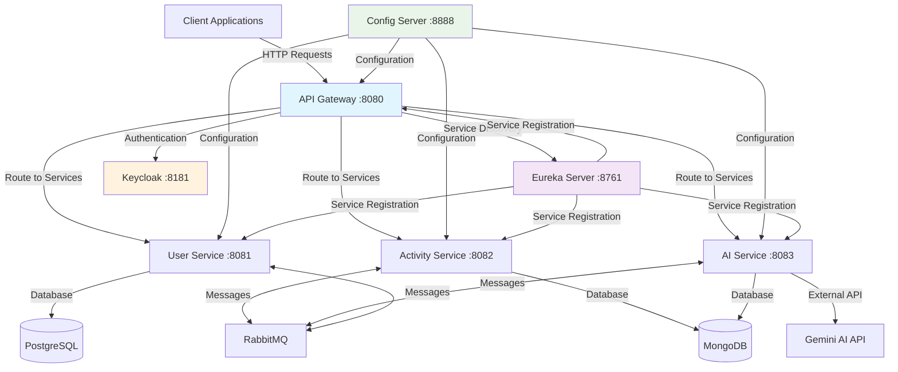
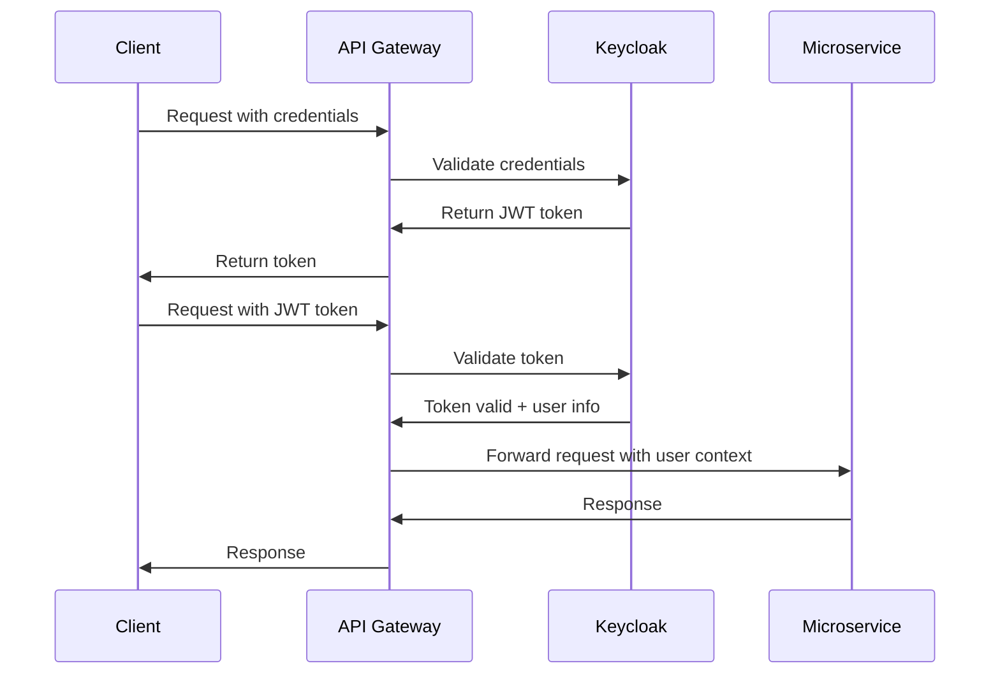
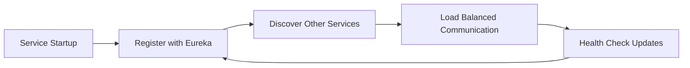
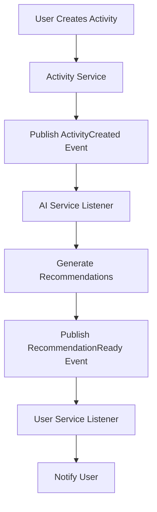

# 🏋️‍♂️ FitnessMicroServices

[](https://www.oracle.com/java/)
[](https://spring.io/projects/spring-boot)
[](https://spring.io/projects/spring-cloud)
[](https://maven.apache.org/)
[](LICENSE)
[](https://reactjs.org/)
[](https://www.mongodb.com/)
[](https://www.postgresql.org/)

A modern, cloud-native fitness tracking platform built with microservices architecture. This system combines Spring Cloud infrastructure with AI-powered recommendations, real-time activity tracking, and secure user management to deliver a comprehensive fitness solution.

## 📑 Table of Contents
1. [Project Overview](#-1-project-overview)
2. [Technology Stack](#-2-technology-stack)
3. [Architecture](#-3-architecture)
4. [Features](#-4-features)
5. [Services](#-5-services)
6. [Getting Started](#-6-getting-started)
7. [API Documentation](#-7-api-documentation)
8. [Security](#-8-security)
9. [Monitoring](#-9-monitoring)
10. [Contributing](#-10-contributing)

## 📌 1. Project Overview

**FitnessMicroServices** is a distributed fitness tracking platform designed to help users monitor their fitness activities, receive AI-powered personalized recommendations, and manage their fitness journey. The system is built using microservices architecture to ensure scalability, maintainability, and fault tolerance.

### Key Capabilities:
- **Activity Tracking**: Log and monitor various fitness activities with detailed metrics
- **AI-Powered Recommendations**: Get personalized fitness suggestions using advanced AI models
- **User Management**: Complete user registration, authentication, and profile management
- **Centralized Configuration**: Dynamic configuration management across all services
- **Service Discovery**: Automatic service registration and discovery
- **API Gateway**: Unified entry point with authentication and routing

---

## 🔧 2. Technology Stack

### Backend Technologies
- **Java 23**: Latest JDK with enhanced features
- **Spring Boot 3.4.3**: Modern application framework with native support
- **Spring Cloud 2024.0.0**: Full microservices infrastructure
  - Spring Cloud Config: Centralized configuration
  - Spring Cloud Gateway: API Gateway with routing
  - Netflix Eureka: Service discovery
  - Spring Cloud Circuit Breaker: Resilience4j integration
  - Spring Cloud Stream: Event-driven architecture
- **Keycloak**: Robust identity and access management
- **Maven 3.9.9**: Dependency management and build automation

### Databases & Storage
- **PostgreSQL** - Primary database for user data
- **MongoDB** - Document storage for activities and recommendations
- **RabbitMQ** - Message broker for inter-service communication

### Development & Testing
- **Lombok** - Code generation and boilerplate reduction
- **Spring Boot Test** - Testing framework
- **Postman** - API testing and documentation
- **Docker** - Containerization (optional)

---

## 🧱 3. Microservices Architecture

The system follows a microservices architecture pattern with clear separation of concerns:

### Service Architecture

| Service | Port | Technologies | Description |
|---------|------|--------------|-------------|
| **Config Server** | 8888 | Spring Cloud Config | Centralized configuration management, Git-backed config |
| **Eureka Server** | 8761 | Netflix Eureka | Service discovery, registration, and load balancing |
| **API Gateway** | 8080 | Spring Cloud Gateway | Request routing, authentication, rate limiting, circuit breaking |
| **User Service** | 8081 | Spring Boot, PostgreSQL | User management, profiles, OAuth2/OpenID Connect |
| **Activity Service** | 8082 | Spring Boot, MongoDB | Activity tracking, metrics, real-time updates |
| **AI Service** | 8083 | Spring Boot, Gemini AI | ML-powered recommendations, workout planning |
| **Frontend** | 5173 | React, Redux, Vite | Modern web interface with real-time updates |

### Key Features by Service

#### Config Server (Port: 8888)
- Git-backed configuration
- Encryption/decryption of sensitive properties
- Dynamic configuration updates
- Environment-specific configurations

#### Eureka Server (Port: 8761)
- Automatic service registration
- Service health monitoring
- Load balancing
- Fault tolerance

#### API Gateway (Port: 8080)
- Authentication & authorization
- Rate limiting & throttling
- Circuit breaking
- Request routing & load balancing
- CORS configuration
- API documentation aggregation

#### User Service (Port: 8081)
- User registration & authentication
- Profile management
- Role-based access control
- OAuth2/OpenID Connect with Keycloak
- Email verification
- Password recovery

#### Activity Service (Port: 8082)
- Activity logging & tracking
- Real-time metrics
- Progress monitoring
- Historical data analysis
- Performance statistics
- Workout plans

#### AI Service (Port: 8083)
- Personalized recommendations
- Workout optimization
- Progress analysis
- Goal tracking
- Integration with Gemini AI
- Machine learning models

### System Architecture Diagram



---

## 🔐 4. Authentication with Keycloak

### Integration Overview
The system uses **Keycloak** as the primary Identity and Access Management (IAM) solution, providing:

- **Centralized Authentication**: Single sign-on across all microservices
- **Role-Based Access Control (RBAC)**: Fine-grained permissions management
- **OAuth2/OpenID Connect**: Industry-standard authentication protocols
- **Token-Based Security**: JWT tokens for stateless authentication

### Security Flow



### Keycloak Setup
1. **Realm Configuration**: Create `fitness-oauth2` realm
2. **Client Setup**: Configure clients for each service
3. **User Management**: Define roles (USER, ADMIN, TRAINER)
4. **Token Configuration**: Set token expiration and refresh policies

### Sample Token Structure
```json
{
  "exp": 1642771200,
  "iat": 1642767600,
  "jti": "a4f1b2c3-d4e5-f6g7-h8i9-j0k1l2m3n4o5",
  "iss": "http://localhost:8181/realms/fitness-oauth2",
  "aud": "fitness-client",
  "sub": "f7e6d5c4-b3a2-9180-7f6e-5d4c3b2a1908",
  "typ": "Bearer",
  "azp": "fitness-client",
  "realm_access": {
    "roles": ["USER", "FITNESS_TRACKER"]
  },
  "resource_access": {
    "fitness-client": {
      "roles": ["uma_protection"]
    }
  },
  "preferred_username": "john.doe@fitness.com",
  "email": "john.doe@fitness.com",
  "given_name": "John",
  "family_name": "Doe"
}
```

---

## 🚀 5. How to Run the Project

### Prerequisites
- **Java 23** or higher
- **Maven 3.9+**
- **Docker** (optional, for databases)
- **Keycloak Server** (version 20+)
- **PostgreSQL** (for user service)
- **MongoDB** (for activity and AI services)
- **RabbitMQ** (for message queuing)

### Step-by-Step Startup Guide

#### 1. Start Infrastructure Services
```bash
# Start PostgreSQL (using Docker)
docker run -d --name postgres-fitness \
  -e POSTGRES_DB=fitness_user_db \
  -e POSTGRES_USER=fitness_user \
  -e POSTGRES_PASSWORD=fitness_pass \
  -p 5432:5432 postgres:15

# Start MongoDB (using Docker)
docker run -d --name mongo-fitness \
  -p 27017:27017 mongo:7

# Start RabbitMQ (using Docker)
docker run -d --name rabbitmq-fitness \
  -p 5672:5672 -p 15672:15672 \
  rabbitmq:3-management

# Start Keycloak (using Docker)
docker run -d --name keycloak-fitness \
  -p 8181:8080 \
  -e KEYCLOAK_ADMIN=admin \
  -e KEYCLOAK_ADMIN_PASSWORD=admin \
  quay.io/keycloak/keycloak:20.0.1 start-dev
```

#### 2. Start Microservices (in order)

**Step 1: Config Server**
```bash
cd configserver
./mvnw spring-boot:run
```
Wait for: `Started ConfigServerApplication on port 8888`

**Step 2: Eureka Server**
```bash
cd eureka
./mvnw spring-boot:run
```
Wait for: `Started EurekaApplication on port 8761`

**Step 3: User Service**
```bash
cd userservice
./mvnw spring-boot:run
```
Wait for: `Started UserServiceApplication on port 8081`

**Step 4: Activity Service**
```bash
cd activityservice
./mvnw spring-boot:run
```
Wait for: `Started ActivityServiceApplication on port 8082`

**Step 5: AI Service**
```bash
cd aiservice
export GEMINI_API_KEY=your_gemini_api_key_here
./mvnw spring-boot:run
```
Wait for: `Started AiServiceApplication on port 8083`

**Step 6: API Gateway**
```bash
cd gateway
./mvnw spring-boot:run
```
Wait for: `Started GatewayApplication on port 8080`

#### 3. Verify Services
Check Eureka Dashboard: http://localhost:8761
All services should appear as registered instances.

### Quick Start Script
```bash
#!/bin/bash
# start-fitness-services.sh

echo "Starting Config Server..."
cd configserver && ./mvnw spring-boot:run &
sleep 30

echo "Starting Eureka Server..."
cd ../eureka && ./mvnw spring-boot:run &
sleep 30

echo "Starting User Service..."
cd ../userservice && ./mvnw spring-boot:run &
sleep 20

echo "Starting Activity Service..."
cd ../activityservice && ./mvnw spring-boot:run &
sleep 20

echo "Starting AI Service..."
cd ../aiservice && ./mvnw spring-boot:run &
sleep 20

echo "Starting Gateway..."
cd ../gateway && ./mvnw spring-boot:run &

echo "All services starting... Check Eureka at http://localhost:8761"
```

---

## 🛠 6. Configuration Management

### Centralized Configuration Strategy
The system uses **Spring Cloud Config Server** for centralized configuration management:

```
config-repo/
├── application.yml              # Global configuration
├── application-dev.yml         # Development environment
├── application-prod.yml        # Production environment
├── gateway.yml                 # Gateway-specific config
├── userservice.yml            # User service config
├── activityservice.yml        # Activity service config
└── aiservice.yml              # AI service config
```

### Configuration Hierarchy
1. **bootstrap.yml** - Service bootstrap configuration
2. **Config Server** - Centralized configuration
3. **application.yml** - Local service configuration
4. **Environment Variables** - Runtime overrides

### Sample Configuration

**application.yml (Config Server)**
```yaml
spring:
  application:
    name: fitness-config-server
  cloud:
    config:
      server:
        git:
          uri: https://github.com/your-org/fitness-config-repo
          default-label: main
server:
  port: 8888

eureka:
  client:
    service-url:
      defaultZone: http://localhost:8761/eureka/
```

**gateway.yml (Config Repository)**
```yaml
spring:
  cloud:
    gateway:
      routes:
        - id: user-service
          uri: lb://user-service
          predicates:
            - Path=/api/users/**
          filters:
            - StripPrefix=2
        - id: activity-service
          uri: lb://activity-service
          predicates:
            - Path=/api/activities/**
          filters:
            - StripPrefix=2
        - id: ai-service
          uri: lb://ai-service
          predicates:
            - Path=/api/recommendations/**
          filters:
            - StripPrefix=2

  security:
    oauth2:
      resourceserver:
        jwt:
          issuer-uri: http://localhost:8181/realms/fitness-oauth2
```

---

## 🔁 7. Service Communication

### Service Discovery Flow


### Communication Patterns

#### 1. Synchronous Communication (REST)
```java
@RestClient
public interface ActivityServiceClient {
    @GetMapping("/activities/user/{userId}")
    List<Activity> getUserActivities(@PathVariable String userId);
}
```

#### 2. Asynchronous Communication (RabbitMQ)
```java
@RabbitListener(queues = "fitness.activity.created")
public void handleActivityCreated(ActivityCreatedEvent event) {
    generateRecommendations(event.getUserId(), event.getActivity());
}
```

#### 3. Event-Driven Architecture


---

## 📂 8. Project Folder Structure

```
fitness_microservices/
├── fitness-app-microservices/           # Main project directory
│   ├── activityservice/                 # Activity management service
│   │   ├── src/main/java/com/fitness/activityservice/
│   │   │   ├── controller/             # REST controllers
│   │   │   ├── service/                # Business logic
│   │   │   ├── repository/             # Data access layer
│   │   │   ├── model/                  # Entity models
│   │   │   └── config/                 # Configuration classes
│   │   ├── src/main/resources/
│   │   │   ├── application.yml         # Service configuration
│   │   │   └── bootstrap.yml           # Bootstrap configuration
│   │   ├── pom.xml                     # Maven dependencies
│   │   └── mvnw                        # Maven wrapper
│   │
│   ├── aiservice/                      # AI recommendation service
│   │   ├── src/main/java/com/fitness/aiservice/
│   │   │   ├── controller/             # AI endpoints
│   │   │   ├── service/                # AI logic & Gemini integration
│   │   │   ├── model/                  # Data models
│   │   │   └── config/                 # AI configuration
│   │   ├── src/main/resources/
│   │   │   └── application.yml
│   │   ├── pom.xml
│   │   └── mvnw
│   │
│   ├── configserver/                   # Centralized configuration
│   │   ├── src/main/java/com/fitness/configserver/
│   │   │   └── ConfigServerApplication.java
│   │   ├── src/main/resources/
│   │   │   ├── application.yml
│   │   │   └── config/                 # Configuration files
│   │   ├── pom.xml
│   │   └── mvnw
│   │
│   ├── eureka/                         # Service discovery
│   │   ├── src/main/java/com/fitness/eureka/
│   │   │   └── EurekaApplication.java
│   │   ├── src/main/resources/
│   │   │   └── application.yml
│   │   ├── pom.xml
│   │   └── mvnw
│   │
│   ├── gateway/                        # API Gateway
│   │   ├── src/main/java/com/fitness/gateway/
│   │   │   ├── config/                 # Gateway configuration
│   │   │   ├── filter/                 # Custom filters
│   │   │   └── GatewayApplication.java
│   │   ├── src/main/resources/
│   │   │   └── application.yml
│   │   ├── pom.xml
│   │   └── mvnw
│   │
│   ├── userservice/                    # User management service
│   │   ├── src/main/java/com/fitness/userservice/
│   │   │   ├── controller/             # User endpoints
│   │   │   ├── service/                # User business logic
│   │   │   ├── repository/             # User data access
│   │   │   ├── model/                  # User entities
│   │   │   └── security/               # Security configuration
│   │   ├── src/main/resources/
│   │   │   ├── application.yml
│   │   │   └── db/migration/           # Database migrations
│   │   ├── pom.xml
│   │   └── mvnw
│   │
│   ├── fitness-app-frontend/           # React frontend (optional)
│   │   ├── src/
│   │   ├── package.json
│   │   └── vite.config.js
│   │
│   ├── README.md                       # This file
│   ├── docker-compose.yml              # Infrastructure setup
│   └── start-services.sh               # Service startup script
│
├── config-repo/                        # Configuration repository
│   ├── application.yml
│   ├── application-dev.yml
│   ├── application-prod.yml
│   ├── gateway.yml
│   ├── userservice.yml
│   ├── activityservice.yml
│   └── aiservice.yml
│
└── docs/                               # Documentation
    ├── api/                            # API documentation
    ├── architecture/                   # Architecture diagrams
    └── deployment/                     # Deployment guides
```

---

## 📬 9. Sample API Requests

### Authentication Endpoints

#### User Registration
```bash
curl -X POST http://localhost:8080/api/auth/register \
  -H "Content-Type: application/json" \
  -d '{
    "email": "john.doe@fitness.com",
    "password": "SecurePass123!",
    "firstName": "John",
    "lastName": "Doe"
  }'
```

#### User Login
```bash
curl -X POST http://localhost:8080/api/auth/login \
  -H "Content-Type: application/json" \
  -d '{
    "email": "john.doe@fitness.com",
    "password": "SecurePass123!"
  }'
```

### Activity Management

#### Create Activity
```bash
curl -X POST http://localhost:8080/api/activities \
  -H "Authorization: Bearer $JWT_TOKEN" \
  -H "Content-Type: application/json" \
  -d '{
    "type": "RUNNING",
    "duration": 3600,
    "caloriesBurned": 500,
    "additionalMetrics": {
      "distance": 5.2,
      "avgHeartRate": 145,
      "maxHeartRate": 165
    }
  }'
```

#### Get User Activities
```bash
curl -X GET http://localhost:8080/api/activities/user/12345 \
  -H "Authorization: Bearer $JWT_TOKEN"
```

### AI Recommendations

#### Get Personalized Recommendations
```bash
curl -X GET http://localhost:8080/api/recommendations/user/12345 \
  -H "Authorization: Bearer $JWT_TOKEN"
```

#### Generate New Recommendations
```bash
curl -X POST http://localhost:8080/api/recommendations/generate \
  -H "Authorization: Bearer $JWT_TOKEN" \
  -H "Content-Type: application/json" \
  -d '{
    "userId": "12345",
    "preferences": ["CARDIO", "STRENGTH_TRAINING"],
    "fitnessLevel": "INTERMEDIATE",
    "goals": ["WEIGHT_LOSS", "MUSCLE_GAIN"]
  }'
```

### Health Check Endpoints
```bash
# Check all service health
curl http://localhost:8080/actuator/health

# Check specific service
curl http://localhost:8081/actuator/health  # User Service
curl http://localhost:8082/actuator/health  # Activity Service
curl http://localhost:8083/actuator/health  # AI Service
```

### Postman Collection
Import the following collection for comprehensive API testing:

**Download**: [FitnessMicroServices.postman_collection.json](./docs/api/FitnessMicroServices.postman_collection.json)

---

## ⚙️ 10. Deployment & Scaling Notes

### Docker Containerization

#### Multi-Stage Dockerfile Example
```dockerfile
# Build stage
FROM openjdk:23-jdk-slim as build
WORKDIR /app
COPY pom.xml .
COPY src src
RUN ./mvnw clean package -DskipTests

# Runtime stage
FROM openjdk:23-jre-slim
WORKDIR /app
COPY --from=build /app/target/*.jar app.jar
EXPOSE 8080
ENTRYPOINT ["java", "-jar", "app.jar"]
```

#### Docker Compose Setup
```yaml
version: '3.8'
services:
  config-server:
    build: ./configserver
    ports:
      - "8888:8888"
    environment:
      - SPRING_PROFILES_ACTIVE=docker

  eureka-server:
    build: ./eureka
    ports:
      - "8761:8761"
    depends_on:
      - config-server

  gateway:
    build: ./gateway
    ports:
      - "8080:8080"
    depends_on:
      - eureka-server
      - config-server
    environment:
      - EUREKA_CLIENT_SERVICE_URL_DEFAULTZONE=http://eureka-server:8761/eureka/
```

### Kubernetes Deployment

#### Service Deployment Example
```yaml
apiVersion: apps/v1
kind: Deployment
metadata:
  name: user-service
spec:
  replicas: 3
  selector:
    matchLabels:
      app: user-service
  template:
    metadata:
      labels:
        app: user-service
    spec:
      containers:
      - name: user-service
        image: fitness/user-service:latest
        ports:
        - containerPort: 8081
        env:
        - name: SPRING_PROFILES_ACTIVE
          value: k8s
```

### Horizontal Scaling Considerations

#### Load Balancing with Eureka
- Services automatically register multiple instances
- Spring Cloud LoadBalancer provides client-side load balancing
- Gateway routes requests across healthy instances

```java
@LoadBalanced
@Bean
public RestTemplate restTemplate() {
    return new RestTemplate();
}
```

#### Database Scaling
- **PostgreSQL**: Read replicas for user service
- **MongoDB**: Sharding for activity data
- **Connection Pooling**: HikariCP for optimal performance

#### Monitoring & Observability
```yaml
management:
  endpoints:
    web:
      exposure:
        include: health,info,metrics,prometheus
  endpoint:
    health:
      show-details: always
```

### Performance Tuning
- **JVM Options**: `-Xmx512m -Xms256m`
- **Connection Pools**: Optimize database connections
- **Caching**: Redis for frequently accessed data
- **Rate Limiting**: API Gateway throttling

---

## 🧼 11. Developer Notes

### .bak Files Notice
You may notice `.bak` files in the project directory. These are **developer backup files** created during development and refactoring processes. They are:

- **Intentionally excluded** from the Git repository via `.gitignore`
- **Temporary files** containing previous versions of components
- **Safe to delete** once the corresponding feature is stable
- **Not part of the production deployment**

Example `.bak` files you might encounter:
- `KeycloakUserSyncFilter.java.bak` - Backup of authentication filter
- `UserService.java.bak` - Backup of user service implementation

### Code Quality Guidelines
- **Lombok**: Used for reducing boilerplate code
- **Code Coverage**: Maintain >80% test coverage
- **Documentation**: All public APIs must be documented
- **Security**: Never commit credentials or API keys

### Development Workflow
1. **Feature Branch**: Create feature branches from `main`
2. **Testing**: Write unit and integration tests
3. **Code Review**: All changes require peer review
4. **CI/CD**: Automated testing and deployment pipeline

---

## 🔧 12. Troubleshooting

### Common Issues

#### Service Registration Issues
```bash
# Check Eureka registration
curl http://localhost:8761/eureka/apps

# Verify service health
curl http://localhost:8081/actuator/health
```

#### Authentication Problems
```bash
# Validate Keycloak realm
curl http://localhost:8181/realms/fitness-oauth2/.well-known/openid_configuration

# Test token validation
curl -H "Authorization: Bearer $TOKEN" http://localhost:8080/api/users/profile
```

#### Database Connection Issues
```bash
# Check PostgreSQL connection
docker exec -it postgres-fitness psql -U fitness_user -d fitness_user_db

# Check MongoDB connection
docker exec -it mongo-fitness mongosh
```

### Logs and Debugging
```bash
# View service logs
docker logs -f [container-name]

# Enable debug logging
export LOGGING_LEVEL_COM_FITNESS=DEBUG
```

---

## 📚 13. Additional Resources

### Documentation Links
- [Spring Boot Documentation](https://docs.spring.io/spring-boot/docs/current/reference/htmlsingle/)
- [Spring Cloud Documentation](https://spring.io/projects/spring-cloud)
- [Keycloak Documentation](https://www.keycloak.org/documentation)
- [Eureka Wiki](https://github.com/Netflix/eureka/wiki)

### Learning Resources
- **Microservices Patterns** by Chris Richardson
- **Spring Microservices in Action** by John Carnell
- **Building Microservices** by Sam Newman

### Community
- [Spring Community Forum](https://spring.io/community)
- [Stack Overflow - Spring Boot](https://stackoverflow.com/questions/tagged/spring-boot)
- [GitHub Discussions](https://github.com/Nikhilratoliya6/FitnessMicroServices/discussions)

---

## 📄 14. License and Contributors

### License
This project is licensed under the **MIT License** - see the [LICENSE](LICENSE) file for details.

```
MIT License

Copyright (c) 2025 FitnessMicroServices Contributors

Permission is hereby granted, free of charge, to any person obtaining a copy
of this software and associated documentation files (the "Software"), to deal
in the Software without restriction, including without limitation the rights
to use, copy, modify, merge, publish, distribute, sublicense, and/or sell
copies of the Software, and to permit persons to whom the Software is
furnished to do so, subject to the following conditions:

The above copyright notice and this permission notice shall be included in all
copies or substantial portions of the Software.
```

### Contributors

#### Project Lead
- **Nikhil Ratoliya** ([@Nikhilratoliya6](https://github.com/Nikhilratoliya6))
  - Project Architecture & Design
  - Microservices Implementation
  - AI Service Integration

#### Core Contributors
- **[Your Name]** - Authentication & Security
- **[Contributor Name]** - Frontend Development
- **[Contributor Name]** - DevOps & Deployment

### Contributing
We welcome contributions! Please see our [Contributing Guidelines](CONTRIBUTING.md) for details on:
- Code of Conduct
- Development setup
- Pull request process
- Issue reporting

### Acknowledgments
- **Spring Team** for the excellent microservices framework
- **Keycloak Team** for robust identity management
- **Google Gemini** for AI capabilities
- **Netflix OSS** for service discovery patterns

---

## 🎯 Future Roadmap

### Planned Features
- [ ] **Mobile Apps**: iOS and Android applications
- [ ] **Social Features**: Friend connections and challenges
- [ ] **Wearable Integration**: Fitbit, Apple Watch, Garmin
- [ ] **Advanced Analytics**: ML-powered insights
- [ ] **Nutrition Tracking**: Meal planning and calorie tracking
- [ ] **Coaching Platform**: Professional trainer integration

### Technical Improvements
- [ ] **GraphQL API**: Alternative to REST endpoints
- [ ] **Event Sourcing**: Complete audit trail
- [ ] **CQRS Pattern**: Command/Query separation
- [ ] **Distributed Tracing**: Request flow monitoring
- [ ] **Chaos Engineering**: Resilience testing

---

**Built with ❤️ by the FitnessMicroServices Team**

*Last Updated: July 27, 2025*
